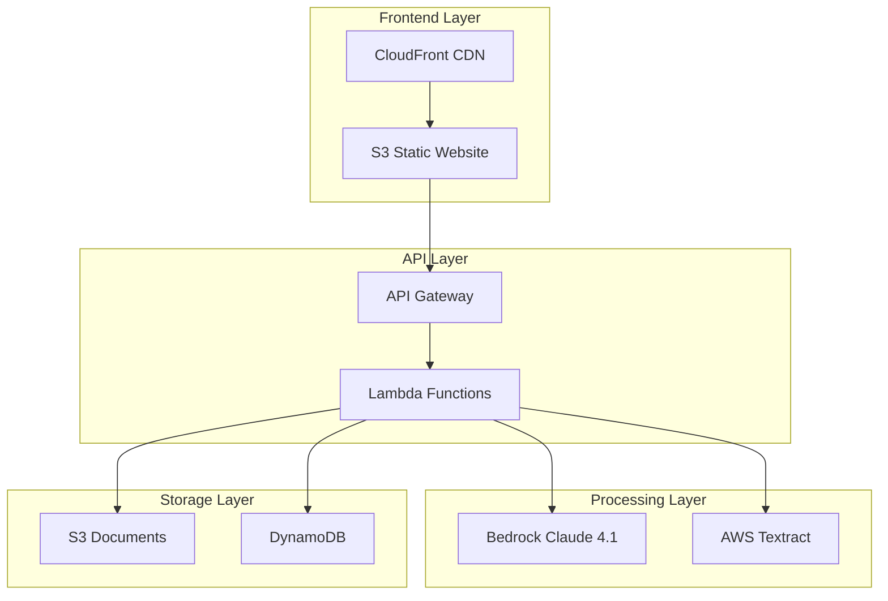

# MASTER PROMPT - Plataforma de Extracción ASPOR

## 🎯 Prompt para Replicar el Sistema Completo

Si necesitas recrear este sistema desde cero, usa el siguiente prompt con Claude o cualquier asistente de IA:

---

### PROMPT DE IMPLEMENTACIÓN

```
Necesito crear una plataforma serverless AWS para extracción de información legal con las siguientes características:

OBJETIVO:
Sistema de análisis documental que procese escrituras públicas y documentos legales usando Amazon Bedrock Claude 4.1, con dos modelos especializados:
1. Modelo A: Validación de contragarantías y poderes notariales
2. Modelo B: Generación de informes societarios

ARQUITECTURA REQUERIDA:
- AWS Lambda (Python 3.12) para procesamiento
- API Gateway para endpoints REST
- DynamoDB para metadata
- S3 para almacenamiento
- Bedrock Claude 4.1 para análisis IA
- Textract para OCR
- CloudFront para frontend
- SAM/CloudFormation para IaC

FUNCIONALIDADES:
1. Upload de 1-3 archivos PDF/DOCX
2. Selección de modelo de análisis (A o B)
3. Generación de reportes en DOCX/PDF
4. Historial de ejecuciones con descarga
5. Interfaz web responsive

ENDPOINTS API:
- POST /runs/presign - URLs para carga
- POST /runs - Crear ejecución
- GET /runs - Listar historial
- GET /runs/{id} - Detalles
- DELETE /runs/{id} - Eliminar

ESTRUCTURA DYNAMODB:
- PK: USER#{userId}
- SK: RUN#{timestamp}#{runId}
- Atributos: model, files, status, output

Por favor genera:
1. Template SAM completo (template.yaml)
2. Código Python para todas las Lambdas
3. Frontend HTML con JavaScript
4. Scripts de despliegue
5. README con instrucciones
```

---

## 📋 Documentación Técnica Completa

### Arquitectura del Sistema



### Componentes Principales

#### 1. Lambda Functions

```python
# aspor-presign
def handler(event, context):
    """Genera URLs presigned para carga de archivos"""
    file_count = body.get('file_count', 1)
    presigned_urls = []
    for i in range(file_count):
        url = s3_client.generate_presigned_post(...)
        presigned_urls.append(url)
    return presigned_urls

# aspor-create-run
def handler(event, context):
    """Crea y procesa nueva ejecución"""
    model = body.get('model')  # A o B
    files = body.get('files')
    # Procesar con Bedrock
    result = call_bedrock_claude(model, text)
    # Generar reporte
    create_report(result, output_format)
    return download_url

# aspor-get-run
def handler(event, context):
    """Obtiene detalles y genera URL de descarga"""
    run = get_from_dynamodb(run_id)
    download_url = generate_presigned_url(run['output'])
    return run_with_url

# aspor-list-runs
def handler(event, context):
    """Lista historial con paginación"""
    runs = query_dynamodb(user_id)
    return paginated_results

# aspor-delete-run
def handler(event, context):
    """Elimina run y archivos asociados"""
    delete_from_s3(run['files'])
    delete_from_dynamodb(run_id)
    return success
```

#### 2. DynamoDB Schema

```json
{
  "TableName": "aspor-extractions",
  "KeySchema": [
    {"AttributeName": "pk", "KeyType": "HASH"},
    {"AttributeName": "sk", "KeyType": "RANGE"}
  ],
  "AttributeDefinitions": [
    {"AttributeName": "pk", "AttributeType": "S"},
    {"AttributeName": "sk", "AttributeType": "S"}
  ],
  "GlobalSecondaryIndexes": [{
    "IndexName": "GSI1",
    "Keys": ["gsi1pk", "gsi1sk"]
  }]
}

// Ejemplo de item:
{
  "pk": "USER#default-user",
  "sk": "RUN#20250826193751#uuid",
  "runId": "uuid",
  "model": "A",
  "files": ["s3-key-1", "s3-key-2"],
  "fileNames": ["doc1.pdf", "doc2.pdf"],
  "status": "COMPLETED",
  "output": {
    "docx": "outputs/uuid/report.docx",
    "downloadUrl": "https://..."
  }
}
```

#### 3. Prompts de IA

**Modelo A - Contragarantías:**
```
Analiza escrituras para validar:
- Facultades para suscribir pagarés
- Poder para otorgar mandatos
- Capacidad contratar seguros
- Identificar apoderados por clases
- Formas de actuación conjunta/individual

Genera informe con:
- Información societaria
- Validación de poderes
- Lista apoderados habilitados
- Conclusión capacidad de firma
```

**Modelo B - Informes Sociales:**
```
Extrae y estructura:
- Datos cliente (RUT, razón social)
- Objeto social literal
- Capital y distribución
- Socios y participaciones
- Administración
- Directorio
- Vigencia
- Domicilio
- Antecedentes notariales

Formato: Informe profesional para estudios jurídicos
```

### Configuración de Bedrock

```python
BEDROCK_CONFIG = {
    "modelId": "anthropic.claude-opus-4-1-20250805-v1:0",
    "anthropic_version": "bedrock-2023-05-31",
    "max_tokens": 8000,
    "temperature": 0.3,
    "top_p": 0.95,
    "stop_sequences": []
}

def call_bedrock(prompt):
    response = bedrock_client.invoke_model(
        modelId=BEDROCK_CONFIG["modelId"],
        contentType="application/json",
        body=json.dumps({
            "messages": [{
                "role": "user",
                "content": prompt
            }],
            **BEDROCK_CONFIG
        })
    )
    return parse_response(response)
```

### Frontend Interface

```html
<!DOCTYPE html>
<html>
<head>
    <title>ASPOR - Plataforma de Extracción</title>
    <style>
        /* Diseño moderno y responsive */
        .container { max-width: 1200px; }
        .upload-zone { border: 2px dashed #667eea; }
        .status-badge { padding: 4px 8px; border-radius: 4px; }
        .status-completed { background: #48bb78; }
        .status-processing { background: #ed8936; }
        .status-failed { background: #f56565; }
    </style>
</head>
<body>
    <div class="container">
        <!-- Upload Section -->
        <div class="upload-zone" id="dropZone">
            Arrastra archivos aquí o haz clic para seleccionar
        </div>
        
        <!-- Model Selection -->
        <select id="modelSelect">
            <option value="A">Modelo A - Contragarantías</option>
            <option value="B">Modelo B - Informes Sociales</option>
        </select>
        
        <!-- Process Button -->
        <button onclick="processDocuments()">Procesar</button>
        
        <!-- History Table -->
        <table id="historyTable">
            <thead>
                <tr>
                    <th>Fecha</th>
                    <th>Archivos</th>
                    <th>Modelo</th>
                    <th>Estado</th>
                    <th>Acciones</th>
                </tr>
            </thead>
            <tbody id="historyBody"></tbody>
        </table>
    </div>
    
    <script>
        const API_BASE_URL = 'https://api.example.com/prod';
        
        async function processDocuments() {
            // 1. Get presigned URLs
            const presignResponse = await fetch(`${API_BASE_URL}/runs/presign`, {
                method: 'POST',
                body: JSON.stringify({ file_count: files.length })
            });
            
            // 2. Upload files to S3
            for (let i = 0; i < files.length; i++) {
                await uploadToS3(presignUrls[i], files[i]);
            }
            
            // 3. Process with selected model
            const runResponse = await fetch(`${API_BASE_URL}/runs`, {
                method: 'POST',
                body: JSON.stringify({
                    model: selectedModel,
                    files: s3Keys,
                    outputFormat: 'docx'
                })
            });
            
            // 4. Show download link
            showDownloadLink(runResponse.downloadUrl);
        }
        
        async function loadHistory() {
            const response = await fetch(`${API_BASE_URL}/runs`);
            const data = await response.json();
            renderHistory(data.runs);
        }
    </script>
</body>
</html>
```

### Scripts de Despliegue

#### Windows (PowerShell)
```powershell
# deploy-windows.ps1
$StackName = "aspor-platform"
$Region = "us-east-1"

Write-Host "Deploying ASPOR Platform..." -ForegroundColor Yellow

# Build SAM application
sam build

# Deploy with parameters
sam deploy `
    --stack-name $StackName `
    --region $Region `
    --capabilities CAPABILITY_IAM `
    --parameter-overrides `
        BedrockModel=anthropic.claude-opus-4-1-20250805-v1:0

Write-Host "Deployment complete!" -ForegroundColor Green

# Get outputs
$ApiUrl = aws cloudformation describe-stacks `
    --stack-name $StackName `
    --query 'Stacks[0].Outputs[?OutputKey==`ApiEndpoint`].OutputValue' `
    --output text

$WebUrl = aws cloudformation describe-stacks `
    --stack-name $StackName `
    --query 'Stacks[0].Outputs[?OutputKey==`WebsiteURL`].OutputValue' `
    --output text

Write-Host "API URL: $ApiUrl" -ForegroundColor Cyan
Write-Host "Web URL: $WebUrl" -ForegroundColor Cyan
```

#### Linux/Mac (Bash)
```bash
#!/bin/bash
# deploy.sh

STACK_NAME="aspor-platform"
REGION="us-east-1"

echo "Deploying ASPOR Platform..."

# Build and deploy
sam build
sam deploy \
    --stack-name $STACK_NAME \
    --region $REGION \
    --capabilities CAPABILITY_IAM \
    --parameter-overrides \
        BedrockModel=anthropic.claude-opus-4-1-20250805-v1:0

# Get outputs
API_URL=$(aws cloudformation describe-stacks \
    --stack-name $STACK_NAME \
    --query 'Stacks[0].Outputs[?OutputKey==`ApiEndpoint`].OutputValue' \
    --output text)

WEB_URL=$(aws cloudformation describe-stacks \
    --stack-name $STACK_NAME \
    --query 'Stacks[0].Outputs[?OutputKey==`WebsiteURL`].OutputValue' \
    --output text)

echo "API URL: $API_URL"
echo "Web URL: $WEB_URL"
```

### Template SAM

```yaml
AWSTemplateFormatVersion: '2010-09-09'
Transform: AWS::Serverless-2016-10-31

Globals:
  Function:
    Runtime: python3.12
    Timeout: 60
    Environment:
      Variables:
        DYNAMODB_TABLE: !Ref ExtractionsTable
        DOCUMENTS_BUCKET: !Ref DocumentsBucket

Resources:
  # DynamoDB Table
  ExtractionsTable:
    Type: AWS::DynamoDB::Table
    Properties:
      TableName: aspor-extractions
      BillingMode: PAY_PER_REQUEST
      
  # S3 Buckets
  DocumentsBucket:
    Type: AWS::S3::Bucket
    Properties:
      BucketName: !Sub 'aspor-docs-${AWS::AccountId}'
      
  # Lambda Functions
  CreateRunFunction:
    Type: AWS::Serverless::Function
    Properties:
      CodeUri: ./
      Handler: lambda_code.handler
      Policies:
        - DynamoDBCrudPolicy:
            TableName: !Ref ExtractionsTable
        - S3CrudPolicy:
            BucketName: !Ref DocumentsBucket
        - Statement:
          - Effect: Allow
            Action: 
              - bedrock:InvokeModel
              - textract:*
            Resource: '*'
            
  # API Gateway
  AsporApi:
    Type: AWS::Serverless::HttpApi
    Properties:
      StageName: prod
      CorsConfiguration:
        AllowOrigins: ['*']
        AllowMethods: ['*']
        AllowHeaders: ['*']

Outputs:
  ApiEndpoint:
    Value: !Sub 'https://${AsporApi}.execute-api.${AWS::Region}.amazonaws.com/prod'
  WebsiteURL:
    Value: !GetAtt CloudFrontDistribution.DomainName
```

### Monitoreo y Mantenimiento

#### CloudWatch Dashboards
```json
{
  "widgets": [
    {
      "type": "metric",
      "properties": {
        "metrics": [
          ["AWS/Lambda", "Invocations", {"stat": "Sum"}],
          [".", "Errors", {"stat": "Sum"}],
          [".", "Duration", {"stat": "Average"}]
        ],
        "period": 300,
        "stat": "Average",
        "region": "us-east-1",
        "title": "Lambda Performance"
      }
    }
  ]
}
```

#### Alertas
```yaml
Alarms:
  HighErrorRate:
    MetricName: Errors
    Threshold: 10
    ComparisonOperator: GreaterThanThreshold
    
  HighLatency:
    MetricName: Duration
    Threshold: 30000
    ComparisonOperator: GreaterThanThreshold
```

### Troubleshooting Common Issues

| Problema | Causa | Solución |
|----------|-------|----------|
| Error 500 | Permisos Lambda | Agregar política IAM para Bedrock |
| Run not found | Query DynamoDB | Verificar filtros y índices |
| Timeout | Documento grande | Aumentar timeout, usar async |
| No download URL | S3 permissions | Verificar bucket policy |

### Costos Estimados AWS

```
Lambda: 100 docs/mes
- Invocaciones: 500 × $0.20/1M = $0.0001
- Duración: 500 × 3s × 3GB = $0.25

S3: 10GB almacenamiento
- Storage: $0.23
- Requests: $0.05

DynamoDB: On-demand
- Writes: $0.25/1M
- Reads: $0.25/1M

Bedrock Claude:
- Input tokens: ~$15/1M tokens
- Output tokens: ~$75/1M tokens
- Total: ~$20/mes

CloudFront: $1

Total mensual: ~$25-30 USD
```

---

## 🚀 Quick Start

```bash
# Clonar repo
git clone https://github.com/dborra-83/CH-Aspor.git

# Configurar AWS
aws configure

# Desplegar
cd CH-Aspor/aspor-extraction-platform
./deploy-windows.ps1  # o ./deploy.sh en Linux

# Verificar
curl https://[API_URL]/health
```

## 📞 Soporte

- Email: dborra@cloudhesive.com
- GitHub: https://github.com/dborra-83/CH-Aspor

---

**Última actualización**: Agosto 2025
**Versión**: 1.0.0
**Desarrollado por**: Diego Borra - CloudHesive para ASPOR