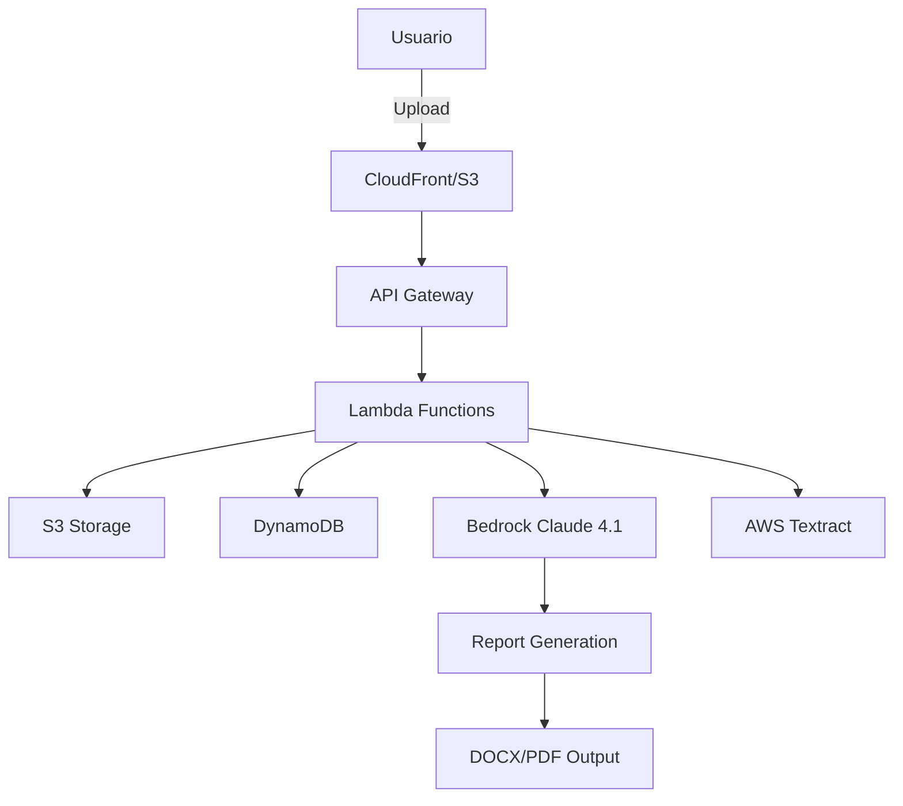

# Plataforma de Extracción ASPOR - AWS + Bedrock Claude 🚀

[](https://aws.amazon.com/)
[](https://aws.amazon.com/bedrock/)
[](https://www.python.org/)
[](https://aws.amazon.com/serverless/sam/)
[](LICENSE)

## 📋 Descripción

**Plataforma ASPOR v1.1** es un sistema serverless inteligente de análisis documental legal que utiliza **Amazon Bedrock Claude Opus 4.1** para validar poderes notariales (contragarantías) y generar informes societarios profesionales automatizados.

### 🎯 Casos de Uso Principales

1. **Análisis de Contragarantías**: Validación automática de poderes y facultades para suscripción de pagarés y contragarantías
2. **Informes Societarios**: Generación de informes profesionales con información societaria completa extraída de escrituras públicas

## ✨ Características

### Nuevas en v1.1
- 🎨 **Interfaz Moderna**: Nueva UI mejorada con diseño profesional
- 👁️ **Vista Previa**: Preview del contenido antes de descarga
- 📥 **Descarga Dinámica**: Generación on-demand de DOCX/PDF
- 🗂️ **Gestión de Prompts**: Carga dinámica desde S3 con fallback SSM

### Características Core
- 📄 **Procesamiento Multi-documento**: Hasta 3 archivos PDF/DOCX por ejecución
- 🤖 **IA Avanzada**: Integración con Amazon Bedrock Claude Opus 4.1
- 📊 **Dos Modelos Especializados**:
  - Modelo A: Contragarantías y análisis de poderes
  - Modelo B: Informes societarios profesionales
- 📑 **Salidas Profesionales**: Reportes en formato DOCX y PDF
- 🔍 **OCR Inteligente**: Procesamiento de documentos escaneados con AWS Textract
- 📈 **Historial Completo**: Almacenamiento y consulta de todas las ejecuciones
- 💰 **Costo Optimizado**: Arquitectura 100% serverless, pago por uso
- 🔐 **Seguro**: Pre-signed URLs, encriptación en reposo, IAM roles

## 🏗️ Arquitectura



### Componentes AWS

| Servicio | Función | Configuración |
|----------|---------|---------------|
| **Lambda** | Procesamiento serverless | Python 3.12, 3GB RAM, 900s timeout |
| **API Gateway** | REST API | CORS habilitado |
| **S3** | Almacenamiento de documentos | Encriptación AES-256 |
| **DynamoDB** | Metadata y estado | On-demand billing |
| **Bedrock** | Procesamiento IA | Claude Opus 4.1 |
| **CloudFront** | CDN para frontend | Cache optimizado |
| **Textract** | OCR documentos | Detección automática |

## 🚀 Instalación Rápida

### Prerequisitos

- ✅ Cuenta AWS con acceso a Bedrock
- ✅ AWS CLI configurado
- ✅ PowerShell (Windows) o Bash (Linux/Mac)
- ✅ Python 3.12+
- ✅ Git

### Despliegue en 3 Pasos

```bash
# 1. Clonar repositorio
git clone https://github.com/dborra-83/CH-Aspor.git
cd CH-Aspor

# 2. Configurar AWS (si no está configurado)
aws configure

# 3. Desplegar (Windows)
cd aspor-extraction-platform
.\deploy-windows.ps1
```

¡Listo! 🎉 La URL de tu aplicación aparecerá al finalizar.

## 📖 Guía de Uso

### Interfaz Web

1. **Acceder** a la URL de CloudFront proporcionada
2. **Cargar** 1-3 archivos (PDF/DOCX)
3. **Seleccionar** modelo:
   - **Modelo A**: Para validación de contragarantías
   - **Modelo B**: Para informes sociales
4. **Elegir** formato de salida (DOCX/PDF)
5. **Procesar** y descargar el reporte

### API REST

```bash
# 1. Obtener URL de carga
curl -X POST https://[API_URL]/runs/presign \
  -H "Content-Type: application/json" \
  -d '{"file_count": 1}'

# 2. Procesar documento
curl -X POST https://[API_URL]/runs \
  -H "Content-Type: application/json" \
  -d '{
    "model": "A",
    "files": ["s3_key"],
    "fileNames": ["documento.pdf"],
    "outputFormat": "docx"
  }'

# 3. Obtener resultado
curl https://[API_URL]/runs/[RUN_ID]?userId=default-user
```

## 📁 Estructura del Proyecto

```
CH-Aspor/
├── 📄 README.md                    # Este archivo
├── 📄 MASTER_PROMPT.md             # Documentación técnica detallada
├── 📄 CLAUDE.md                    # Guía para asistentes IA
├── 📄 CONTRAGARANTIAS.txt          # Prompt Modelo A
├── 📄 INFORMES SOCIALES.txt        # Prompt Modelo B
└── aspor-extraction-platform/
    ├── 🏗️ template.yaml           # Infraestructura SAM completa
    ├── 🔧 deploy-windows.ps1       # Script despliegue Windows
    ├── 🔧 update-lambdas.ps1       # Actualización rápida de funciones
    ├── 📦 lambda_code_fixed.py     # Handler principal mejorado
    ├── 📦 lambda_process_run.py    # Procesamiento Bedrock
    ├── 📦 lambda_download_handler.py # Nueva: Manejo de descargas
    ├── 📦 lambda_preview_run.py    # Nueva: Vista previa
    ├── 📦 lambda_get_run.py        # Obtener run mejorado
    ├── 📦 lambda_list_runs.py      # Listar historial
    ├── 📦 lambda_delete_run.py     # Eliminar run
    ├── 📦 lambda_presign.py        # URLs de carga
    └── frontend/
        ├── index.html              # Interfaz web principal
        ├── index_modern.html       # Nueva UI moderna
        └── index_preview.html      # UI con preview
```

## 🔍 Modelos de Extracción

### 📋 Modelo A - Contragarantías/ASPOR

**Analiza escrituras públicas para validar:**
- ✅ Capacidad de firma de pagarés
- ✅ Facultades para otorgar mandatos
- ✅ Poder para contratar seguros
- ✅ Identificación de apoderados por clases
- ✅ Formas de actuación (individual/conjunta)

**Salida:** Informe detallado con validación legal de poderes

### 📊 Modelo B - Informes Sociales

**Extrae información societaria:**
- 📌 Datos del cliente (razón social, RUT)
- 📌 Objeto social completo
- 📌 Capital social y distribución
- 📌 Socios y participación
- 📌 Estructura administrativa
- 📌 Antecedentes notariales

**Salida:** Informe social profesional estructurado

## 📊 API Endpoints

| Método | Endpoint | Descripción |
|--------|----------|-------------|
| `POST` | `/runs/presign` | Genera URLs para carga de archivos |
| `POST` | `/runs` | Crea nueva ejecución |
| `GET` | `/runs` | Lista historial de ejecuciones |
| `GET` | `/runs/{runId}` | Obtiene detalles de ejecución |
| `GET` | `/runs/{runId}/preview` | **Nuevo**: Vista previa del contenido |
| `GET` | `/runs/{runId}/download/{format}` | **Nuevo**: Descarga en formato específico |
| `DELETE` | `/runs/{runId}` | Elimina ejecución |

## 🔧 Configuración Avanzada

### Actualizar Prompts

Los prompts están almacenados en archivos de texto que pueden modificarse:

1. Editar `CONTRAGARANTIAS.txt` o `INFORMES SOCIALES.txt`
2. Los cambios se aplicarán en el próximo procesamiento

### Variables de Entorno Lambda

```python
DYNAMODB_TABLE = 'aspor-extractions'
DOCUMENTS_BUCKET = 'aspor-documents-[ACCOUNT_ID]'
BEDROCK_MODEL = 'anthropic.claude-opus-4-1-20250805-v1:0'
```

## 📈 Monitoreo

### CloudWatch Logs

```bash
# Ver logs de procesamiento
aws logs tail /aws/lambda/aspor-create-run --follow

# Ver logs de errores
aws logs filter-log-events \
  --log-group-name /aws/lambda/aspor-process-run \
  --filter-pattern "ERROR"
```

### Métricas Disponibles

- ⏱️ Tiempo de procesamiento por documento
- 📊 Cantidad de ejecuciones por modelo
- ❌ Tasa de error
- 💾 Uso de almacenamiento S3

## 💰 Costos Estimados

| Componente | Costo Mensual (100 docs) |
|------------|-------------------------|
| Lambda | ~$2.00 |
| S3 | ~$1.00 |
| DynamoDB | ~$1.00 |
| Bedrock Claude | ~$20.00 |
| API Gateway | ~$1.00 |
| CloudFront | ~$1.00 |
| **Total** | **~$26.00 USD** |

## 🐛 Solución de Problemas

### Error: "Bedrock not available"
```bash
# Verificar acceso a Bedrock
aws bedrock list-foundation-models --region us-east-1

# Habilitar modelo en consola AWS
```

### Error: "500 Internal Server Error"
```bash
# Verificar permisos Lambda
aws lambda get-function-configuration \
  --function-name aspor-create-run \
  --query 'Role'
```

### Error: "Run not found"
```bash
# Verificar datos en DynamoDB
aws dynamodb scan \
  --table-name aspor-extractions \
  --region us-east-1
```

## 🔒 Seguridad

- 🔐 URLs de descarga temporales (1 hora)
- 🔐 Cifrado en reposo (S3 y DynamoDB)
- 🔐 IAM roles con permisos mínimos
- 🔐 CORS configurado para dominio específico
- 🔐 Sin almacenamiento de credenciales

## 🚧 Roadmap

### v1.0 (Completado)
- ✅ Procesamiento con Bedrock Claude 4.1
- ✅ Generación DOCX/PDF
- ✅ Interfaz web completa
- ✅ Historial con descarga

### v1.1 (Actual - Agosto 2025)
- ✅ Nueva interfaz moderna mejorada
- ✅ Vista previa de documentos
- ✅ Generación dinámica de formatos
- ✅ Gestión mejorada de prompts
- ✅ Optimización de rendimiento

### v2.0 (Próximo)
- [ ] Autenticación con AWS Cognito
- [ ] Procesamiento batch de documentos
- [ ] Exportación a Excel
- [ ] API Keys para integración externa
- [ ] Dashboard de métricas en tiempo real

## 🤝 Contribución

1. Fork el proyecto
2. Crear rama (`git checkout -b feature/NuevaCaracteristica`)
3. Commit cambios (`git commit -m 'Add: Nueva característica'`)
4. Push a la rama (`git push origin feature/NuevaCaracteristica`)
5. Abrir Pull Request

## 📄 Licencia

Propiedad de ASPOR. Uso interno únicamente.

## 👥 Créditos

- **Desarrollo**: Diego Borra - CloudHesive
- **Cliente**: ASPOR
- **Tecnología**: AWS + Amazon Bedrock Claude Opus 4.1

## 📞 Soporte

- 📧 Email: dborra@cloudhesive.com
- 🐙 GitHub: https://github.com/dborra-83/CH-Aspor
- 🐛 Issues: https://github.com/dborra-83/CH-Aspor/issues

---

**Desarrollado con ❤️ para ASPOR | Powered by AWS & Claude AI**