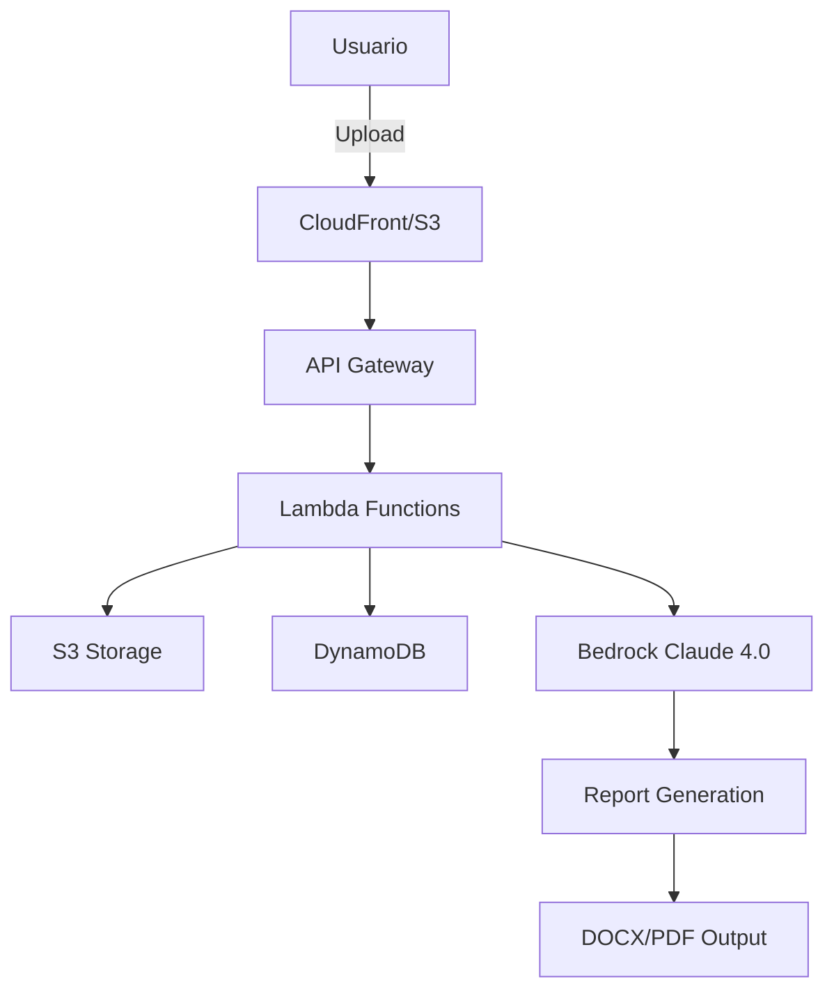

# CH-ASPOR 🚀

[](https://aws.amazon.com/)
[](https://aws.amazon.com/bedrock/)
[](https://www.python.org/)
[](LICENSE)

## 📋 Descripción

**CH-ASPOR** es una plataforma serverless de extracción y análisis de información legal que utiliza inteligencia artificial (Amazon Bedrock Claude 4.0) para procesar documentos societarios y generar informes profesionales automatizados.

### 🎯 Casos de Uso Principales

1. **Análisis de Contragarantías**: Validación automática de poderes y facultades para suscripción de pagarés y contragarantías
2. **Informes Societarios**: Generación de informes profesionales con información societaria completa extraída de escrituras públicas

## ✨ Características

- 📄 **Procesamiento Multi-documento**: Hasta 3 archivos PDF/DOCX por ejecución
- 🤖 **IA Avanzada**: Integración con Amazon Bedrock Claude 4.0
- 📊 **Dos Modelos Especializados**:
  - Modelo A: Contragarantías y análisis de poderes
  - Modelo B: Informes societarios profesionales
- 📑 **Salidas Profesionales**: Reportes en formato DOCX y PDF
- 🔍 **OCR Inteligente**: Procesamiento de documentos escaneados con AWS Textract
- 📈 **Historial Completo**: Almacenamiento y consulta de todas las ejecuciones
- 💰 **Costo Optimizado**: Arquitectura 100% serverless, pago por uso
- 🔐 **Seguro**: Pre-signed URLs, encriptación en reposo, IAM roles

## 🏗️ Arquitectura



### Componentes AWS

| Servicio | Función | Configuración |
|----------|---------|---------------|
| **Lambda** | Procesamiento serverless | Python 3.12, 3GB RAM, 900s timeout |
| **API Gateway** | REST API | CORS habilitado, throttling 1000 req/s |
| **S3** | Almacenamiento de documentos | Lifecycle 90 días, encriptación AES-256 |
| **DynamoDB** | Metadata y estado | On-demand, point-in-time recovery |
| **Bedrock** | Procesamiento IA | Claude 4.0, temperature 0.1 |
| **CloudFront** | CDN para frontend | Cache behaviors optimizados |
| **SSM** | Gestión de prompts | Parameter Store para configuración |

## 🚀 Instalación Rápida

### Prerequisitos

- ✅ Cuenta AWS con acceso a Bedrock
- ✅ AWS CLI configurado
- ✅ SAM CLI instalado
- ✅ Python 3.12+
- ✅ Git

### Despliegue en 3 Pasos

```bash
# 1. Clonar repositorio
git clone https://github.com/dborra-83/CH-Aspor.git
cd CH-Aspor/aspor-extraction-platform

# 2. Configurar AWS (si no está configurado)
aws configure

# 3. Desplegar
chmod +x deploy.sh
./deploy.sh
```

¡Listo! 🎉 La URL de tu aplicación aparecerá al finalizar.

## 📖 Documentación Detallada

### Estructura del Proyecto

```
CH-Aspor/
├── 📄 CONTRAGARANTIAS.txt      # Prompt Modelo A
├── 📄 INFORMES SOCIALES.txt    # Prompt Modelo B
├── 📄 MASTER_PROMPT.md         # Documentación técnica completa
├── aspor-extraction-platform/
│   ├── 🏗️ template.yaml       # Infraestructura SAM
│   ├── 📦 requirements.txt     # Dependencias Python
│   ├── 🚀 deploy.sh           # Script de despliegue
│   ├── 🔧 Makefile            # Comandos útiles
│   ├── src/
│   │   ├── handlers/          # Lambda functions
│   │   ├── processors/        # Lógica de procesamiento
│   │   └── generators/        # Generación de reportes
│   └── frontend/
│       └── index.html         # Interfaz web
```

### API Endpoints

| Método | Endpoint | Descripción |
|--------|----------|-------------|
| `POST` | `/runs/presign` | Obtener URLs para upload |
| `POST` | `/runs` | Crear nueva extracción |
| `GET` | `/runs/{id}` | Consultar estado |
| `GET` | `/runs` | Listar historial |
| `DELETE` | `/runs/{id}` | Eliminar ejecución |

### Modelos de Extracción

#### 🔍 Modelo A - Contragarantías/ASPOR

Analiza escrituras públicas para:
- Validar facultades para suscribir pagarés
- Identificar apoderados por clases (A, B, C)
- Determinar grupos de actuación conjunta
- Detectar vencimientos y restricciones
- Generar matriz de validación completa

#### 📊 Modelo B - Informes Sociales

Genera informes profesionales con:
- Información societaria completa
- Objeto social (transcripción literal)
- Capital social detallado
- Tabla de socios y participaciones
- Estructura administrativa
- Antecedentes legales y notariales

## 💻 Uso

### Interfaz Web

1. Acceder a la URL proporcionada tras el despliegue
2. Arrastrar o seleccionar archivos (máx. 3)
3. Elegir modelo de extracción
4. Seleccionar formato de salida
5. Procesar y descargar

### API REST (Postman)

```bash
# Importar colección
postman_collection.json incluida en el proyecto

# O usar curl
curl -X POST https://api-url/runs \
  -H "Content-Type: application/json" \
  -d '{"model":"A","files":["file1.pdf"],"outputFormat":"docx"}'
```

### CLI (Make)

```bash
make help          # Ver comandos disponibles
make deploy        # Desplegar aplicación
make update-prompts # Actualizar prompts
make logs          # Ver logs en tiempo real
make status        # Estado del stack
make destroy       # Eliminar recursos
```

## 📊 Monitoreo y Métricas

### CloudWatch Dashboards

El sistema registra automáticamente:
- ⏱️ Latencia de procesamiento
- 📈 Tokens utilizados (entrada/salida)
- ❌ Errores y excepciones
- 📊 Métricas de uso por modelo

### Costos Estimados

| Componente | Costo Mensual (100 docs) |
|------------|-------------------------|
| Lambda | ~$0.50 |
| S3 | ~$2.00 |
| DynamoDB | ~$1.00 |
| Bedrock | ~$15.00 |
| API Gateway | ~$1.00 |
| **Total** | **~$20-25 USD** |

## 🔧 Configuración Avanzada

### Actualizar Prompts

```python
# Método 1: Script Python
python upload_prompts.py --region us-east-1

# Método 2: Make
make update-prompts

# Método 3: AWS CLI
aws ssm put-parameter \
  --name "/aspor/prompts/agent-a-contragarantias" \
  --value "$(cat CONTRAGARANTIAS.txt)" \
  --overwrite
```

### Variables de Entorno

```yaml
BEDROCK_MODEL_ID: anthropic.claude-3-opus-20240229
MAX_FILES: 3
MAX_FILE_SIZE_MB: 25
LAMBDA_TIMEOUT: 900
```

## 🐛 Troubleshooting

| Problema | Solución |
|----------|----------|
| **"Model not found"** | Habilitar Claude en Bedrock console |
| **"Access Denied"** | Verificar permisos IAM |
| **Procesamiento lento** | Aumentar memoria Lambda a 3008MB |
| **PDF no se procesa** | Verificar que Textract esté disponible |
| **Costos elevados** | Revisar métricas de tokens, ajustar temperature |

## 🚦 Roadmap

- [x] MVP con 2 modelos de extracción
- [x] Generación DOCX/PDF
- [x] Historial de ejecuciones
- [ ] Autenticación con Cognito
- [ ] Procesamiento batch (>3 archivos)
- [ ] Dashboard analítico con QuickSight
- [ ] API webhooks para integraciones
- [ ] Caché de resultados frecuentes

## 🤝 Contribuir

Las contribuciones son bienvenidas. Por favor:

1. Fork el proyecto
2. Crea una rama (`git checkout -b feature/AmazingFeature`)
3. Commit cambios (`git commit -m 'Add AmazingFeature'`)
4. Push a la rama (`git push origin feature/AmazingFeature`)
5. Abre un Pull Request

## 📝 Licencia

Proyecto propietario para uso interno. Todos los derechos reservados.

## 👥 Equipo

- **Desarrollo**: [@dborra-83](https://github.com/dborra-83)
- **Arquitectura**: Serverless AWS
- **IA**: Amazon Bedrock Claude 4.0

## 📞 Soporte

- 📧 Email: [Contactar en GitHub](https://github.com/dborra-83)
- 🐛 Issues: [GitHub Issues](https://github.com/dborra-83/CH-Aspor/issues)
- 📚 Docs: Ver [MASTER_PROMPT.md](MASTER_PROMPT.md) para documentación técnica completa

## 🙏 Agradecimientos

- Amazon Web Services por la infraestructura cloud
- Anthropic por Claude 4.0
- La comunidad open source

---

<div align="center">
  
**[⬆ Volver arriba](#ch-aspor-)**

Hecho con ❤️ usando AWS Serverless

</div>